# **Journey Metrics**

Monitor multi-step authentication flows (login, MFA, OAuth) using simple request counters and ratios. Track end-to-end conversion with control charts.

---

## Core idea

Funnel tools are great for product analytics, but for SLOs and alerts we found them tricky—they need user tracking, custom events, and can get expensive.

This approach uses **aggregate request counts only**:
- Count requests per step per window (no user IDs)
- Compute ratios between steps
- Monitor with control charts

This gives you:
- Low cardinality metrics (cheap)
- Simple math
- Easy integration with standard metrics backends


## Concepts and notation

We work with time windows (for example, 1, 5, or 15 minutes). For each window $t$:

- **Step** $i$: a state in the auth journey ("login form", "OTP page", "/authorize", etc.).
- **Arrival** $A_i(t)$: number of requests entering step $i$ in window $t$.
- **Transition ratio** $T_i(t)$: fraction of requests that move from step $i$ to step $i+1$:
  $$T_i(t) = \frac{A_{i+1}(t)}{A_i(t)}.$$
- **Terminal Success**: last step with a clear success condition (for example final HTTP 2xx). We denote its index as step $S$.
- **Conversion** $C(t)$: ratio of requests in window $t$ that reached Success (step $S$) to requests that entered step 1 in the same window:
  $$C(t) = \frac{A_{S}(t)}{A_1(t)} = \prod_{i=1}^{S-1} T_i(t).$$

Notes:
- We count **requests**, not unique users; retries are part of the signal.
- Ratios $T_i(t)$ and $C(t)$ are volume-agnostic, but their **noise** shrinks with more traffic.
- This is a request-level signal (including retries), not a per-user funnel metric.

**Assumptions**
- Steps are sequential (like `/login -> /otp -> /success`)
- Latency between steps is small compared to window size or big windows are acceptable (ie. 15 min)
- Enough traffic that individual requests don't dominate the signal

---

## Example: 4-step auth flow

Example flow:

> Step 1 → Step 2 → Step 3 → Step 4 → Success

For a window $t$:
- $A_i(t)$: arrivals into step $i$, for $i ∈ \{1,2,3,4,5\}$, where step 5 is the terminal success step.
- $T_i(t) = A_{i+1}(t)/A_i(t)$ for $i ∈ \{1,2,3,4\}$.
- End-to-end conversion:
  - $C(t) = A_5(t)/A_1(t)$
  - $= \bigl(A_2(t)/A_1(t)\bigr)\cdot\bigl(A_3(t)/A_2(t)\bigr)\cdot\bigl(A_4(t)/A_3(t)\bigr)\cdot\bigl(A_5(t)/A_4(t)\bigr)$
  - $= T_1(t)\cdot T_2(t)\cdot T_3(t)\cdot T_4(t)$

Interpretation:
- Any drop in any $T_i(t)$ shows up as a drop in $C(t)$.
- $C(t)$ is a single SLO-style number that captures the whole journey.
- You still keep normal per-endpoint SLIs (success rate, latency); $C(t)$ sits on top as the flow SLI.

See [src/metrics_demo.py](src/metrics_demo.py) for code that generates the example plots.

---

## Visualizations

We'll start with basic concepts, then explore how **volume**, **jitter**, and **failures** affect the signal.

All simulations use a 4-step flow: 90% success per step ($T_1 = T_2 = T_3 = 0.9$), giving ~73% end-to-end conversion.

### Part 1: Basic concepts—what are we measuring?

These first plots show the fundamental building blocks: arrivals, transitions, and conversion.

#### 1.1 Arrivals per step – healthy flow

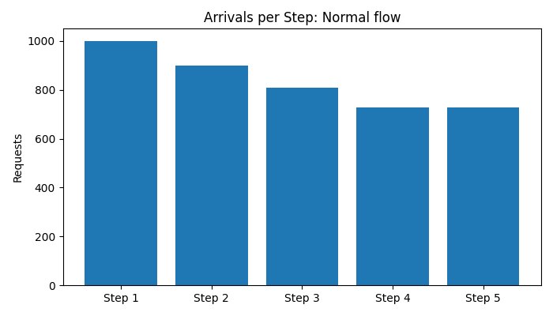

Starting with 1,000 requests at Step 1, we watch how many make it to each subsequent step. With 90% success per step, we see a gradual decline: Step 1 → 1,000, Step 2 → 900, Step 3 → 810, Step 4 → 729, Final → 729.

#### 1.2 Arrivals per step – broken step

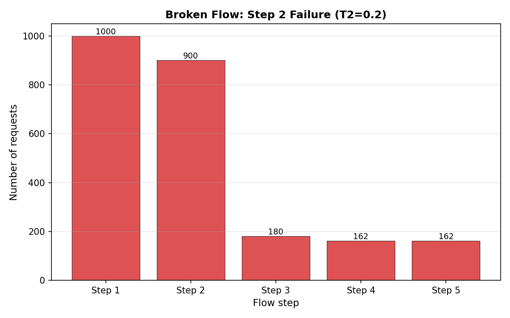

Same starting volume, but when $T_2$ drops to 20%, Step 3 onward sees dramatically fewer requests. The drop at Step 2 creates a "cliff" that persists through the rest of the flow.

#### 1.3 Side-by-side comparison

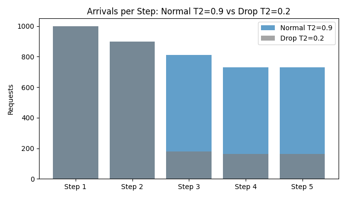

Comparing both scenarios makes the broken step obvious. This is what you'd investigate when $C(t)$ drops: which $A_i(t)$ shows the biggest change?

#### 1.4 Transition ratios

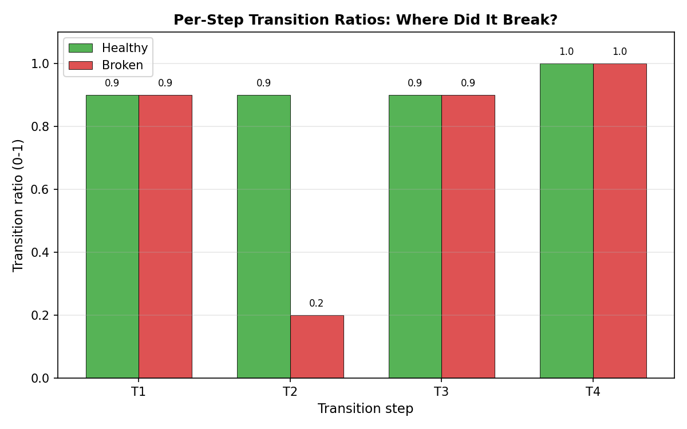

The per-step view: all transitions look healthy except $T_2$. This pinpoints exactly where the flow broke.

#### 1.5 End-to-end conversion

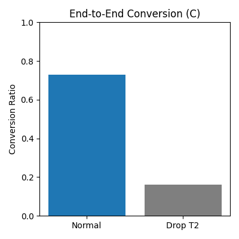

The single number you'd track as your flow SLI: 73% healthy → 16% broken. This is what triggers your alert.

---

### Part 2: Volume matters—sampling noise vs. signal

Key question: **how does traffic volume affect detection?**

#### 2.1 Low volume: 100 requests/window

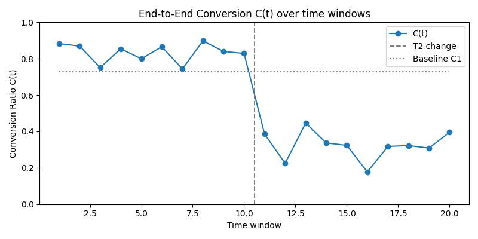

100 requests per window shows noticeable bounce (sampling noise). Control limits need to be wide.

#### 2.2 Medium volume: 10k requests/window

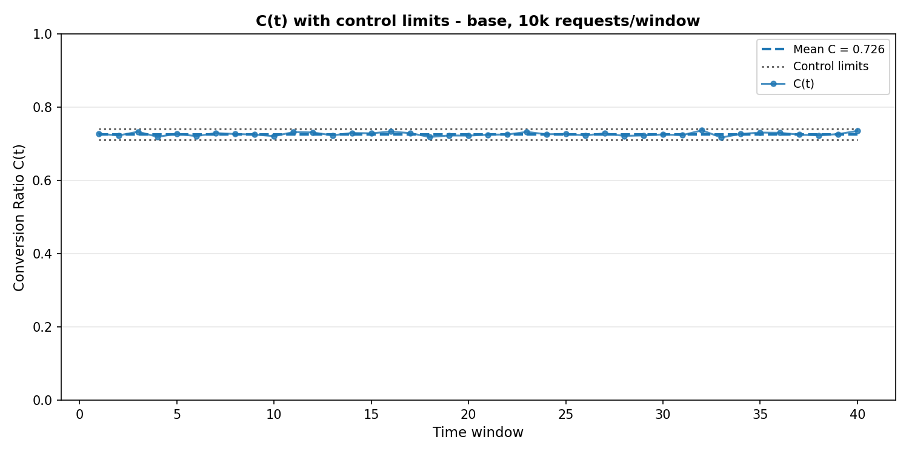

10k requests: much smoother, tighter limits. Good operating range for most production flows.

#### 2.3 High volume: 1M requests/window

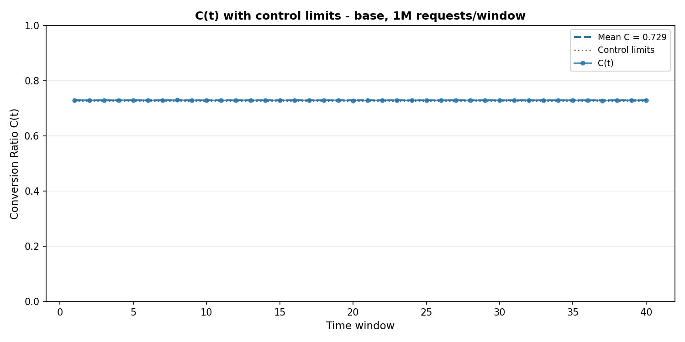

1M requests: nearly flat. Even tiny degradations are obvious.

**Takeaway**: More traffic = cleaner signal.

---

### Part 3: Real-world variability—jitter

Production systems have real variation: performance fluctuations, time-of-day effects, load changes. We model this as **jitter**—each $T_i$ varies ±5% per window.

Key question: **does higher volume eliminate this variation?**

#### 3.1 Timing noise in a single transition


Before looking at full flows, let's see what happens to a single transition $T_1(t)$ measured in 1-minute windows. Three volume levels (20, 200, 2000 users/min) all have the same true success rate (90%, dotted line), but low volume shows dramatic window-to-window swings. This is mostly **timing noise**—requests arriving near window boundaries get counted in one window or the next somewhat randomly.

#### 3.2 Low volume with jitter

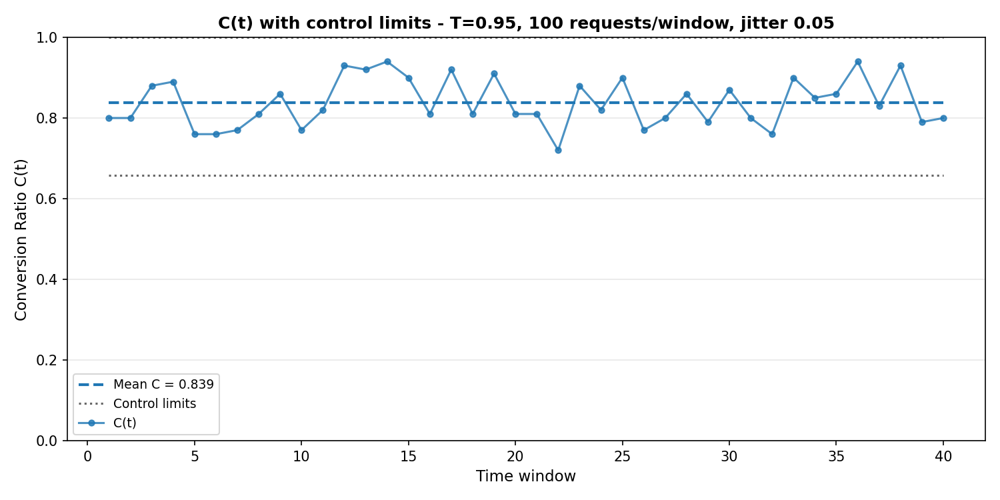

With 100 requests per window and real operational jitter (±5% on each step), $C(t)$ varies significantly. The mean stays around 83% as expected, but individual windows range widely. Control limits must be wide to accommodate this genuine variation.

#### 3.3 High volume with jitter—same problem persists

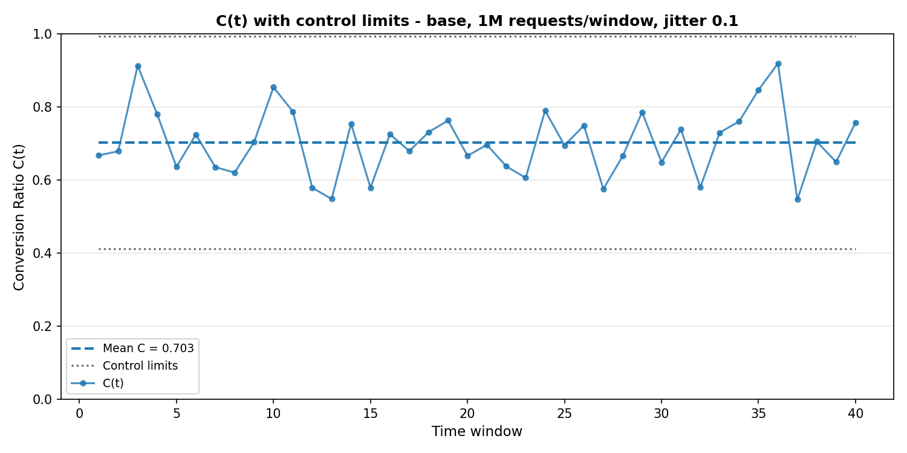

Same flow, same jitter (±5% per step), but with 1M requests per window. The mean is still ~83%, and notice: **the control limits barely tighten**. The variation is still there because it's REAL—each window genuinely has different success rates.

**Key insight**: Volume reduces **sampling noise**, not **real variation**. If your system genuinely fluctuates ±5%, that persists at any scale.

#### 3.4 What can you do about jitter?

Options:
- **Bigger windows**: 15-30 min instead of 5 min (slower detection)
- **Moving averages**: smooth the signal (adds lag)
- **Wider thresholds**: require sustained degradation to alert
- **Fix the source**: improve system stability (best long-term)

#### 3.5 Moving average control limits

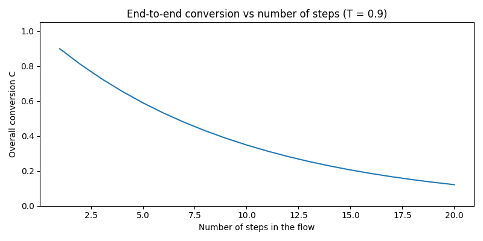

Same scenario, but with a 5-window moving average (blue) instead of raw values (gray). Control limits are much tighter—real degradations stand out clearly.

Tradeoff: adds ~2-3 windows of lag (~10-15 min for 5-min windows), but cleaner signals and fewer false positives.

---

### Part 4: Detecting real failures

At window 40, we inject a failure: $T_2$ drops from 0.9 to 0.8.

#### 4.1 Low volume: 100 requests

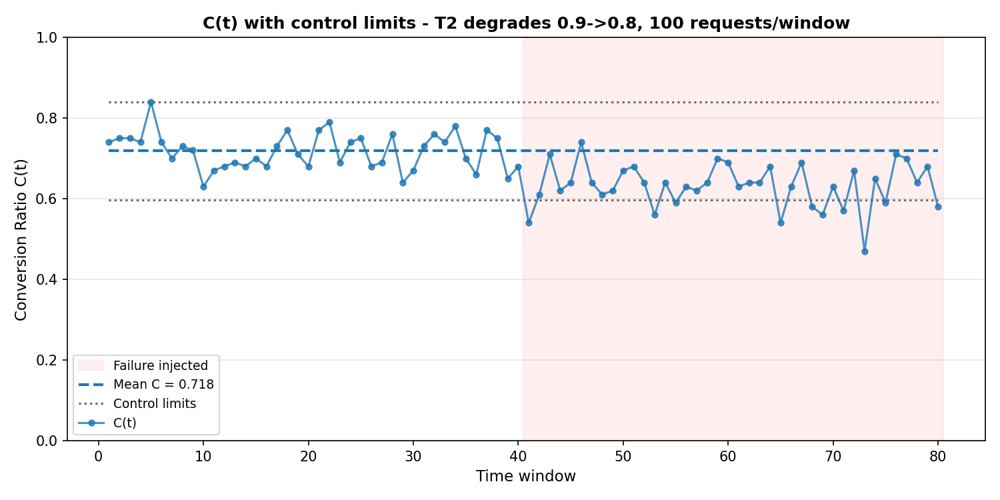

Detectable but noisy. You'd want multiple bad windows before alerting.

#### 4.2 High volume: 1M requests

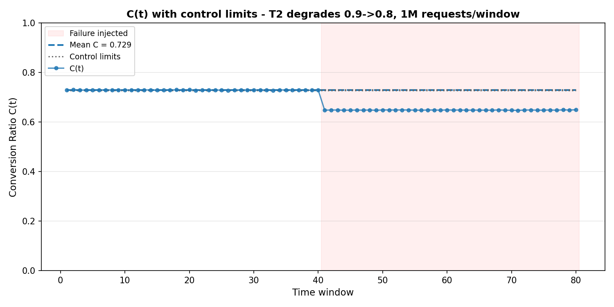

Immediately obvious. Every post-failure window would trigger.

**Takeaway**: Failures are detectable at any volume, but high volume gives cleaner detection.

---

### Part 5: Window sizing

The most common mistake is picking windows that are too small for your flow.

#### Why window size matters

Imagine a 4-step login flow where each step takes ~30 seconds:
- **5-minute window**: Most users complete all steps within one window. When you count requests, Step 1 and Step 4 have similar volumes because they're from the same group of users.
- **30-second window**: A user who starts in window 1 finishes in window 3. Step 1 gets requests from this user, but Step 4 doesn't. You're comparing different groups of users—ratios become meaningless.

#### 5.1 How to tell if your window is wrong

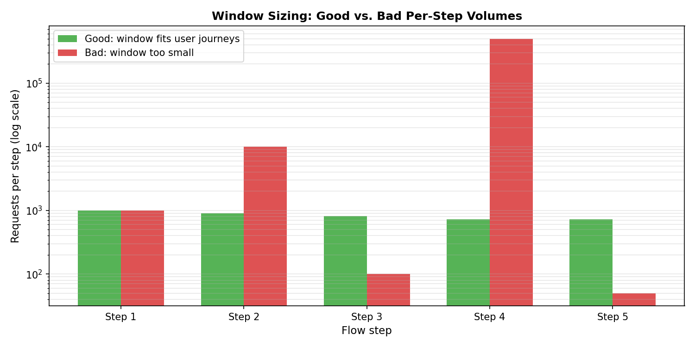

Look at one window and count requests at each step:

**Good window (green bars)**: 
- Step 1: 1000 requests
- Step 2: 900 requests  
- Step 3: 810 requests
- Step 4: 729 requests

Each step sees similar volume (declining gradually due to drop-offs). This means most user journeys fit within one window—requests are properly aligned.

**Bad window (red bars)**:
- Step 1: 1000 requests
- Step 2: 10,000 requests
- Step 3: 100 requests  
- Step 4: 500,000 requests

Volumes vary wildly (1000× differences). This screams "window too small"—you're counting requests from completely different user cohorts at each step.

#### How to choose window size

**Goal**: Pick a window large enough that most users complete the entire flow within one window.

**Rule of thumb**: Look at the **longest typical gap between consecutive steps**, then make the window 5-10× that duration.

**Example: OAuth2 Device Flow**

Your flow has a 10-minute session timeout, meaning users typically complete it in <10 minutes total. Break it down by step:
- Step 1→2: User opens browser after seeing device code (1-3 minutes typically)
- Step 2→3: User types code and authorizes (30 seconds)
- Step 3→4: Device polls and gets token (a few seconds)
- Step 4→5: Device uses token for API call (seconds)

The longest gap is Step 1→2 (let's say p95 is 3 minutes). Using the 5-10× rule:
- **5-minute window**: Should capture most flows (5 min > 3 min longest gap). Good choice.
- **10-minute window**: More conservative, captures even slower users. Also fine.
- **1-minute window**: Too small—many users won't reach Step 2 in the same window.

**Quick check**: 
- If 90% of users complete the flow in 5 minutes, use a 5-minute window
- If you have a 10-minute timeout and most flows finish before timeout, a 10-minute window is safe

**How to validate**: Graph $A_1(t), A_2(t), A_3(t)...$ for a single window. If they're within 2-3× of each other (accounting for drop-offs), you're good. If they vary 10×-1000×, increase window size.

**For flows with long/variable timing** (email verification over hours): This approach doesn't work. Use event-based funnels instead.

---

## Real-world example: OAuth2 Device Code Flow

Let's apply this to a concrete authentication scenario: OAuth2 device authorization for smart TVs, CLI tools, and IoT devices.

### The flow

**Step 1**: Device requests device code  
→ `POST /device_authorization` returns `device_code` and `user_code`

**Step 2**: User visits verification URL  
→ User opens browser, navigates to the `verification_uri`

**Step 3**: User enters code and authorizes  
→ User types the `user_code`, reviews permissions, grants access

**Step 4**: Device polling succeeds  
→ Device polls `POST /token` and receives valid tokens

**Success**: Device has working access token

### Metrics for a 5-minute window

For each window $t$, we count **requests** at each step:
- $A_1(t)$: number of `POST /device_authorization` requests
- $A_2(t)$: number of verification page GET requests (HTTP 200)
- $A_3(t)$: number of successful authorization POST requests (consent granted)
- $A_4(t)$: number of `POST /token` requests that return valid tokens (HTTP 200 with token)
- $A_5(t)$: number of requests to protected resources that succeed with these tokens

Transitions:
- $T_1(t) = A_2(t)/A_1(t)$ — fraction of device auth requests followed by verification page loads in the same window
- $T_2(t) = A_3(t)/A_2(t)$ — fraction of verification page requests followed by successful authorization
- $T_3(t) = A_4(t)/A_3(t)$ — fraction of authorization grants followed by successful token retrieval
- $T_4(t) = A_5(t)/A_4(t)$ — fraction of token requests followed by successful API calls

End-to-end conversion:
$$C(t) = \frac{A_5(t)}{A_1(t)} = T_1(t) \cdot T_2(t) \cdot T_3(t) \cdot T_4(t)$$

Notes:
- We count **requests**, not unique users or devices
- A single user who retries generates multiple device auth requests
- This measures "what fraction of requests successfully progress," including retries
- Not a per-user completion rate over unbounded time

### Typical healthy values

- $T_1 \approx 0.95$ (most device auth requests lead to verification page loads)
- $T_2 \approx 0.85$ (some verification page loads don't result in authorization completion)
- $T_3 \approx 0.98$ (authorization grants reliably lead to token retrieval)
- $T_4 \approx 0.99$ (tokens usually work for API calls)
- Overall $C \approx 0.78$ (~78% of device auth requests result in successful API calls within the same window)

### What this catches

If $T_2$ drops from 0.85 to 0.70:
- Per-endpoint monitoring shows all endpoints returning HTTP 200
- But $C$ drops from $0.95 \times 0.85 \times 0.98 \times 0.99 = 0.78$ to $0.95 \times 0.70 \times 0.98 \times 0.99 = 0.64$ (64%)
- This signals that fewer requests are completing the flow, even though each individual endpoint succeeds

This catches issues like broken verification URLs, confusing UX, or timing problems that per-endpoint success rates miss.

### Visualizations

We show several scenarios to illustrate how different types of changes affect the flow metrics. All plots use **moving average control limits** (5-window rolling mean) to smooth jitter and provide tighter detection bounds.

#### Scenario 0: Volume independence

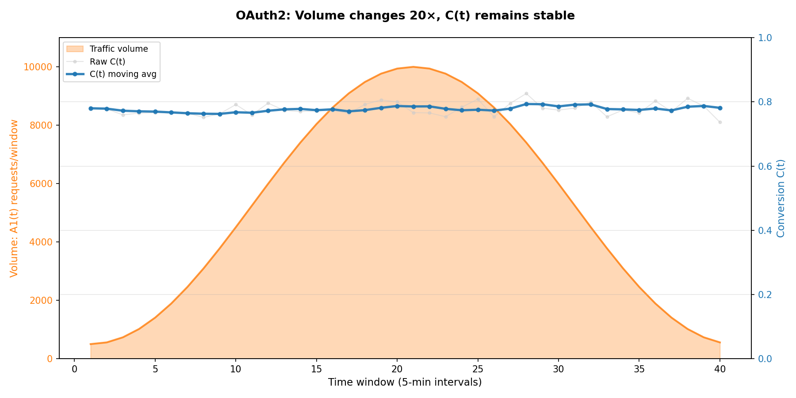

Traffic varies 20× (500→10k→500 req/window), yet $C(t)$ stays ~78%. Volume affects **noise**, not **signal**—this is why ratios work across scales.

#### Scenario 1: User behavior change — T1 drops

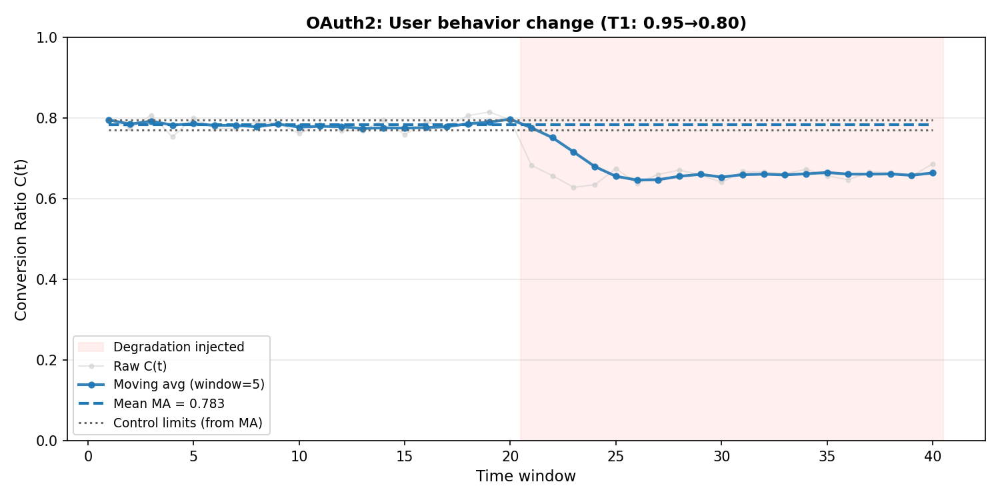

$T_1$ drops from 0.95 to 0.80 at window 20. Likely UX issue (broken link, confusing instructions).

#### Scenario 2: System failure with seasonal traffic — T2 drops

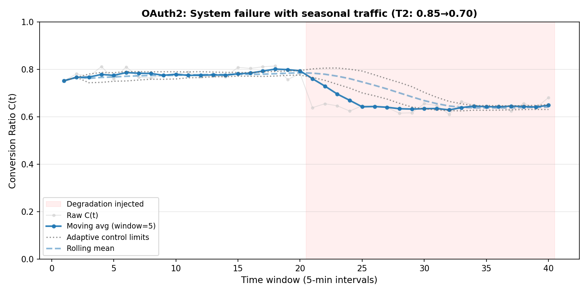

Daily traffic pattern with $T_2$ degradation at window 20. Control limits adapt to volume but still catch the failure.

#### Scenario 3: Seasonal pattern — healthy flow

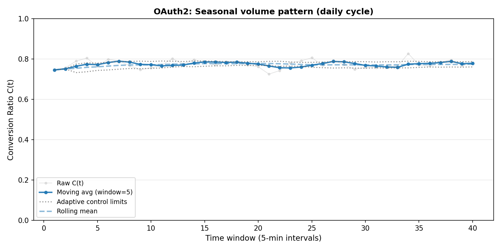

Daily cycle, healthy throughout. Limits adapt automatically: wider at night, tighter at peak.

#### Scenario 4: Polling failure — T3 drops


$T_3$ drops from 0.98 to 0.85. Polling timeouts or rate limiting.

#### Scenario 5: Token validation — T4 drops

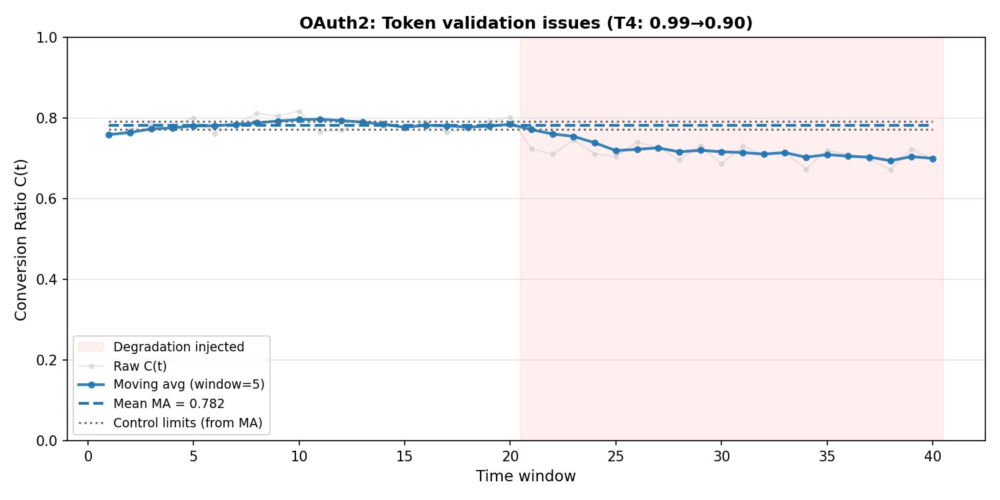

$T_4$ drops from 0.99 to 0.90. Tokens issued but fail on API calls.

-----

## Advanced notes (optional)

These notes help when you roll this out in production.

**Volume and variance**
- Ratios are mathematically volume-agnostic, but variance shrinks with more traffic.
- With very low arrivals per window, $T_i(t)$ and $C(t)$ are noisy; use larger windows or a different tool (funnels, events).

**Time-window selection**
- At low volume: prefer 5–15 minute windows and require multiple bad windows before paging.
- If you know typical step latency, choose window size $W$ roughly $5–10×$ the p95 between steps.
- That way most users finish a step within one window, so $A_i(t)$ and $A_{i+1}(t)$ stay aligned and timing noise is smaller.
- If you ever applied this pattern to flows with very long or highly variable gaps between steps (for example email verification that may take hours, human review, or async jobs), this method would become a coarse, laggy signal for conversion, and you would need a different, event-based approach for precise per-journey analysis.

**Control charts**
- Individuals chart: simple, works when volume per window is roughly stable.
- P‑chart: better when traffic swings a lot; limits widen at low volume and tighten at high.
- You can keep limits static from a known-good period and update them occasionally as the system evolves.
 - If you prefer, you can instead use simple alert rules (for example static SLO-style thresholds on $C(t)$) or built-in anomaly detection / forecasting in your metrics backend, still using the same $T_i(t)$ and $C(t)$ as inputs.

**Non-linear flows**
- In practice each major branch is its own mostly sequential flow (for example `flow=login_password`, `flow=login_sso`, `flow=login_webauthn`).
- For loops and retries, you can usually treat retries as extra noise in $A_i(t)$ and $T_i(t)$; with enough traffic they average out and a retry storm will naturally show up as a drop in $C(t)$. Split out first attempts vs retries only if you need to distinguish "hard failures" from "eventual success after many retries".

**SLIs, SLOs, and cost**
- Typical stack: per-endpoint availability + latency **and** flow conversion $C(t)$.
- A practical flow SLI is the volume-weighted mean conversion over a period $P$: $\text{SLI}_\text{flow}(P) = \frac{\sum_t A_1(t)\,C(t)}{\sum_t A_1(t)}$, which approximates the fraction of attempts that eventually succeed under the assumptions above.
- Per-step SLOs locate the broken component; End to end conversion flow SLOs say whether the journey works.
- A small, controlled `flow` tag adds predictable metric cardinality and is usually cheap in managed backends.


**Traffic mix, bots, and abuse**

- In real systems, not all arrivals are equal: some traffic comes from real users,
some from automated clients, some from abusive sources. All of it contributes to
$A_i(t)$, $T_i(t)$, and $C(t)$.
- If the mix is **stable**, its effect is baked into your baseline and limits.
- When abuse/bot traffic surges, you often see $A_1(t)$ spike and transitions drop.

## Existing approaches and alternatives

This builds on **Google SRE's journey-based SLIs** ([SRE Workbook](https://sre.google/workbook/implementing-slos/#modeling-user-journeys)) and **Statistical Process Control** from manufacturing. We're sharing one way to implement these ideas with concrete math and guidance.

### Comparison with existing tools

| Approach                         | How it works                                                | What it is best at                              | Main tradeoffs                              |
|----------------------------------|-------------------------------------------------------------|-------------------------------------------------|---------------------------------------------|
| Real User Monitoring / Funnels   | Client events per user/session, queried as funnels         | Product analytics, paths, cohorts, UX questions | Needs identity, higher cost, awkward for SLOs |
| Synthetic monitoring             | Bots run scripted journeys                                  | Smoke tests, external checks, third parties     | Fake traffic, limited scenarios, no load info |
| APM / distributed tracing        | Per-request traces across services                          | Deep debugging of specific failures             | High cardinality, sampling, complex queries  |
| High-cardinality observability   | Stores rich, high-cardinality events and fields            | Ad-hoc "show me all requests where…" queries   | Cost grows with cardinality and usage        |
| This **Journey Metrics** model       | Aggregate request counters per step and time window        | Cheap, simple flow SLIs and SLOs               | Less flexible for arbitrary ad-hoc questions |

**When to use what:**
- **RUM/Funnels**: Product analytics, user segmentation
- **Synthetic monitoring**: Smoke tests, uptime checks
- **APM/Tracing**: Debugging specific failures
- **High-cardinality**: Exploratory analysis
- **Journey Metrics**: Cheap flow SLOs and alerts

Not reinventing anything—just tying together journey SLIs, SPC, and standard metrics backends.

----

## Refresh visualizations

Requires [uv](https://docs.astral.sh/uv/):

```sh
uv --version
```

Activate the virtual environment:

```sh
source ./.venv/bin/activate
```

Generate the example plots used in this README:

```sh
python ./src/metrics_demo.py
```