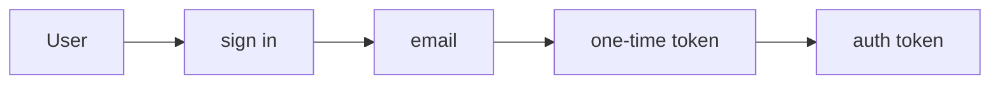
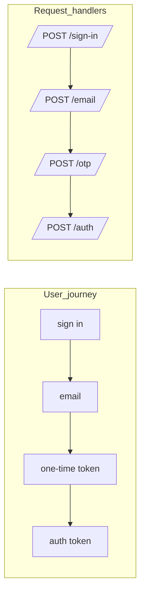
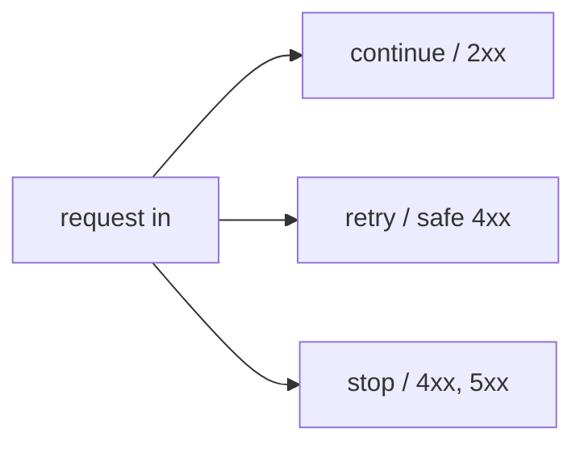
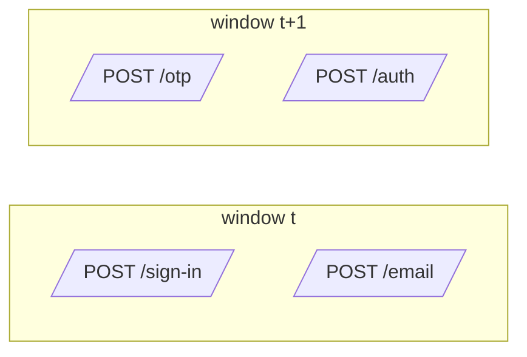

## Auth flows, users, and requests

This document is a **story-first intro** to Journey Metrics.
It uses a concrete auth example to show:
- what the user is doing
- what the server is doing
- what **requests** we actually count
- how time windows turn this into metrics

After this, [README.md](README.md) picks up with the full math
and control-chart visualizations.

### 1. auth flow: user

Consider complex multi-step authentication flows.
- user -> sign in -> email -> one time token -> auth token

What the user can do:
- continue
- stop
- retry
- wait
    - what is the difference between a long wait and a stop?

What can the server do:
- continue, 2xx
- retry, some 4xx
- stop, some 4xx and 5xx

### 2. auth flow: request

request -> sign in
request -> email
request -> one time token
request -> auth token

What we actually measure in Journey Metrics is **requests per step** per window, not per-user state.

- per-user: one state machine from "sign in" to "auth token"
- per-request: separate handlers counting arrivals at each step

### 3. auth flow: server outcomes

From the server perspective, each request ends in one of a few buckets:

- continue (2xx): move the user to the next step
- retry (some 4xx): safely try again
- stop (4xx / 5xx): journey ends here

### 4. time and windows

So far we looked at **one** user or **one** request.
In production we have **many** requests, all the time, from many users.

To make this measurable and alertable we:
- pick a window size (for example 1, 5, or 15 minutes)
- group all requests into these windows
- count how many requests hit each step inside each window

The key rule:
- the window should be **bigger than the typical time between steps**
- if most users go from "sign in" to "auth token" within ~30 seconds,
    a 5-minute window is usually safe

If the window is too small, one user journey can be split across windows:

This makes it harder to relate "step 1" and "step 2" in the same window.
By choosing windows that are **longer than typical step timeouts**, most
requests for a journey stay inside one window.

### 5. from flows to metrics

Once we have windows, for every window `t` we can say things like:

- `A1(t)`: how many requests hit `/sign-in` in this window
- `A2(t)`: how many requests hit `/email` in this window
- `A3(t)`: how many requests hit `/otp` in this window
- `A4(t)`: how many requests hit `/auth` in this window

From these **counts per step, per window** we can build:

- per-step transition ratios (roughly "what fraction moved on to the next step")
- an end-to-end "did the journey succeed?" ratio for each window

flows.md is the **story**: users, requests, steps, and time.
[README.md](README.md) takes over from here and turns this into
the actual math and control charts (plots in `images/`) so you can
run SLOs and alerts on real auth traffic.