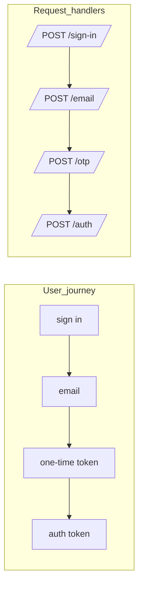
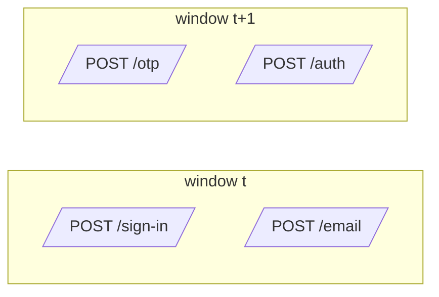

## Auth flows, users, and requests

This document is a **story-first intro** to Journey Metrics.
It uses a concrete auth example to show:
- what the user is doing
- what the server is doing
- what **requests** we actually count
- how time windows turn this into metrics

After this, [README.md](README.md) picks up with the full math
and control-chart visualizations.

### 1. auth flow: user

Consider complex multi-step authentication flows.
- user -> sign in -> email -> one time token -> auth token

What the user can do:
- continue
- stop
- retry
- wait
    - what is the difference between a long wait and a stop?

What can the server do:
- continue, 2xx
- retry, some 4xx
- stop, some 4xx and 5xx


### 2. auth flow: request

request -> sign in
request -> email
request -> one time token
request -> auth token

What we actually measure in Journey Metrics is **requests per step** per window, not per-user state.

- per-user: one state machine from "sign in" to "auth token"
- per-request: separate handlers counting arrivals at each step



### 3. auth flow: server outcomes

From the server perspective, each request ends in one of a few buckets:

- continue (2xx): move the user to the next step
- retry (some 4xx): safely try again
- stop (4xx / 5xx): journey ends here

### 4. time and windows

So far we looked at **one** user or **one** request.
In production we have **many** requests, all the time, from many users.

To make this measurable and alertable we:
- pick a window size (for example 1, 5, or 15 minutes)
- group all requests into these windows
- count how many requests hit each step inside each window

One helpful guideline we've found:
- the window should be **bigger than the typical time between steps**
- if most users go from "sign in" to "auth token" within ~30 seconds,
    a 5-minute window is usually safe

#### 4.1. concrete example: window too small

Suppose your auth flow has these typical timings:
- sign in → email: 2 seconds (server processing)
- email → OTP entry: 15 seconds (user checks email, copies code)
- OTP → auth token: 1 second (server validation)

Total typical journey time: ~18 seconds, p95 might be ~30 seconds.

If you choose **1-minute windows**:
- Most journeys fit in one window ✓
- But users who take 40-70 seconds will span two windows
- Result: some noise, but mostly workable

If you choose **15-second windows**:
- The email→OTP step almost always spans windows ✗
- Your metrics show many sign-ins, few OTP entries per window
- Ratios become meaningless because steps are artificially separated



If you choose **5-minute windows**:
- Almost all journeys fit comfortably in one window ✓
- Even slow users (p99 ~ 2 minutes) stay within the window
- Timing noise is minimal
- This tends to work well for this type of flow

**A starting point**: Consider window size ≥ 5-10× your p95 step-to-step timing. You might need to adjust based on your specific traffic patterns.

#### 4.2. concrete example: volume matters

The same 5-minute window behaves differently at different traffic levels:

**Low traffic (100 sign-ins per 5 minutes)**:
- If true success rate is 90%, you'd expect ~90 successes
- Due to sampling noise, you might see 85-95 in any given window
- That's ±5% variation just from randomness
- Hard to distinguish a real 5% drop from noise

**High traffic (10,000 sign-ins per 5 minutes)**:
- If true success rate is 90%, you'd expect ~9,000 successes  
- Sampling noise: you might see 8,970-9,030 in any window
- That's ±0.3% variation
- A real 5% drop (down to 8,500) is unmistakable

This is why the approach works better at higher volume: the signal-to-noise ratio improves.

#### 4.3. window selection strategy

For production systems:

1. **Measure your flow timing first**: Use traces or logs to get p50, p95, p99 of total journey time
2. **Pick window ≥ 5-10× p95**: This keeps most journeys within one window
3. **Check traffic volume**: Aim for at least 100 sign-ins per window; 1000+ is better
4. **If volume is too low**: Use larger windows (15-30 min) or accept that you're monitoring trends, not real-time
5. **Trade-off**: Larger windows = less noise but slower detection of issues

By choosing windows that are **longer than typical step timeouts**, most
requests for a journey stay inside one window.

### 4.4. user behavior: abandonment and retry

Real users don't follow perfect linear paths. Here's how common patterns affect the metrics:

**Abandonment (user stops mid-flow)**:
- User gets to step 2, gets distracted, never continues
- Metrics: request counted at step 2, but never at step 3
- Effect: lowers the step 2→3 transition ratio
- This is actually **correct behavior**: abandonment should show up as lower conversion

**Quick retry (user mistyped password)**:
- User tries step 1, fails, immediately retries, succeeds
- Metrics: 2 requests at step 1, 1 request at step 2
- Effect: step 1→2 ratio = 50%
- This is measuring **"attempts that succeed on first try"**, not "users who eventually succeed"

**Slow retry (user comes back tomorrow)**:
- User tries step 1 today, gives up
- User tries step 1 again tomorrow, succeeds through to step 4
- Metrics: depends on your window size
  - 5-minute window: two completely separate windows, no connection
  - 24-hour window: both attempts might appear in the same window
- This is why it's helpful to be clear about what you're measuring

**What this approach measures**: This method tracks **"what fraction of requests successfully progress to the next step"** in a given window, including retries. It doesn't track per-user success over unbounded time. This trade-off has some benefits:
- Simpler implementation and lower cost
- Naturally captures retry storms and other operational issues  
- Focuses on "is the system working now?" rather than "did user X eventually succeed?"

For per-user success tracking over days/weeks, funnel or event analytics tools are often a better fit. This approach aims to answer "is the login flow healthy right now?"

### 5. from flows to metrics

Once we have windows, for every window `t` we can say things like:

- `A1(t)`: how many requests hit `/sign-in` in this window
- `A2(t)`: how many requests hit `/email` in this window
- `A3(t)`: how many requests hit `/otp` in this window
- `A4(t)`: how many requests hit `/auth` in this window

From these **counts per step, per window** we can build:

- **Transition ratios**: `T_i(t) = A_{i+1}(t) / A_i(t)` — what fraction of requests at step `i` made it to step `i+1`
- **End-to-end conversion**: `C(t) = A_final(t) / A_1(t)` — what fraction of starting requests reached success

#### 5.1. what these metrics tell you

**Per-step transition ratio `T_i(t)`**:
- "Of the requests that reached step `i`, what % made it to step `i+1`?"
- In our experience, healthy auth flows often see 85-95% (accounting for some abandonment and retries), but your baseline will depend on your specific flow
- Drop below your baseline: might indicate something broke at step `i` or between `i` and `i+1`

**End-to-end conversion `C(t)`**:
- "Of all requests that started the flow, what % completed it?"
- This is the product of all transition ratios: `C(t) = T_1(t) × T_2(t) × T_3(t) × ...`
- If any step fails, `C(t)` drops
- This becomes your **flow SLI**: "99% of 5-minute windows should have C(t) > 70%"

#### 5.2. operational use

Once you have `C(t)` calculated for each window:

1. **Dashboard**: Plot `C(t)` over time with control limits (see README plots)
2. **Alert**: Fire if `C(t)` drops below threshold for N consecutive windows
3. **Debug**: Check which `T_i(t)` dropped to find the broken step
4. **SLO**: Track "% of time windows where C(t) > target" over a month

Example alert rule:
```yaml
alert: AuthFlowDegraded
if: auth_flow_conversion < 0.70 for 10 minutes
# That's 2 consecutive 5-minute windows below 70%
```

### 6. when this approach might be a good fit (and when it might not be)

#### Situations where we've seen this work well:

- **Steps are mostly sequential**: login → MFA → token → success
- **Step timing is bounded**: p99 journey time is minutes, not hours
- **Volume is moderate-to-high**: at least 100 requests per window, ideally 1000+
- **You want operational SLIs**: "Is the login flow healthy right now?"
- **Cost matters**: aggregate counters are cheaper than per-user events

#### Situations where other approaches might be better:

- **Long async steps**: email verification that takes hours/days
  - Windows would need to be very large (1 day+), making detection slow
  - Event-based tracking might be a better fit for these cases
- **Very low traffic**: < 50 requests per window
  - Sampling noise can make ratios jump around quite a bit
  - Consider longer windows, or synthetic monitoring + event tracking might work better
- **Complex branching**: lots of optional paths, loops
  - Can still work, but you need separate flows for each major branch
  - Example: `flow=password_login`, `flow=sso_login`, `flow=webauthn_login`
- **You need per-user analysis**: "Show me all users who failed step 2"
  - This approach has no user IDs, so it can't answer per-user questions
  - Use APM, tracing, or event analytics for this
- **Attribution across long time spans**: "Of users who signed up last month, how many completed setup?"
  - This is a funnel/cohort question, not an operational health question
  - Use product analytics tools

#### A hybrid approach

In our experience, teams often benefit from **combining multiple tools**:

- **Journey Metrics** (this approach): Operational SLIs, alerts, dashboards
- **Distributed tracing**: Debug specific failed requests during incidents  
- **Product analytics/funnels**: Weekly/monthly conversion analysis, A/B tests
- **Synthetic monitoring**: Baseline health checks from multiple regions

Each tool has its strengths. This approach aims to provide a simple, cost-effective operational health signal. Your mileage may vary, and we'd love to hear what works for your team!

### 7. next steps: the math and visualizations

This document covered the **story**: users, requests, steps, time, and when this approach might be useful.

[README.md](README.md) continues with:
- Formal mathematical notation and formulas
- Statistical Process Control and control charts
- 14 example visualizations at different scales
- Thoughts on SLIs, SLOs, and production deployment
- Comparison with RUM, APM, synthetic monitoring, and other tools

If you're interested in trying this out, the concepts here might help with the "why," and README.md has more of the "how."