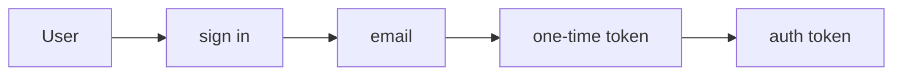
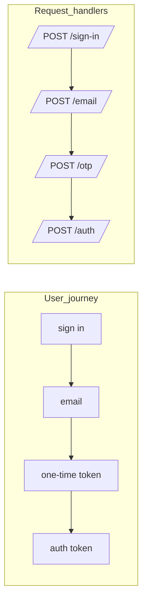
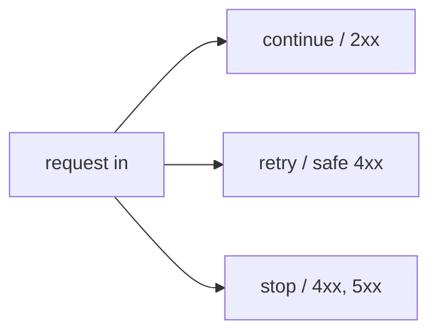

1. auth flow: user

Consider complex multi-step authentication flows.
- user -> sign in -> email -> one time token -> auth token

What the user can do:
- continue
- stop
- retry
- wait
    - what is the difference between a long wait and a stop?

What can the server do:
- continue, 2xx
- retry, some 4xx
- stop, some 4xx and 5xx

2. auth flow: request

request -> sign in
request -> email
request -> one time token
request -> auth token

What we actually measure in Journey Metrics is **requests per step** per window, not per-user state.

- per-user: one state machine from "sign in" to "auth token"
- per-request: separate handlers counting arrivals at each step

3. auth flow: server outcomes

From the server perspective, each request ends in one of a few buckets:

- continue (2xx): move the user to the next step
- retry (some 4xx): safely try again
- stop (4xx / 5xx): journey ends here

